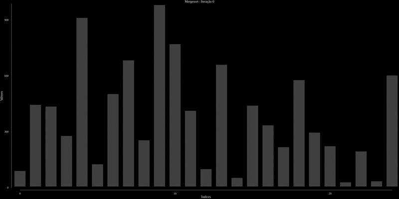

# Algoritimos

Este projeto implementa algoritmos de ordenação, como **mergesort** e **quicksort**, e gera uma visualização em formato **GIF** da execução dos algoritmos. O GIF é criado automaticamente após a execução do algoritmo, utilizando um script bat chamado `createGif.sh`.

## Índice
1. [Visão Geral](#visão-geral)
2. [Instalação](#instalação)
3. [Uso](#uso)
4. [Algoritmos Implementados](#algoritmos-implementados)
5. [Geração de GIF](#geração-de-gif)
6. [Contribuição](#contribuição)
7. [Licença](#licença)
8. [Contato](#contato)

## Visão Geral
Este projeto tem como objetivo fornecer uma implementação clara de todos os algoritmos clássicos, permitindo que o usuário visualize suas etapas em um GIF gerado automaticamente após a execução. Atualmente, o projeto contém os seguintes algoritmos:
- **Mergesort**
- **Quicksort**

## Instalação
Para clonar e configurar o projeto localmente, siga os passos abaixo:

# Clone o repositório
git clone https://github.com/GustFonseca/algoritmos.git

# Entre no diretório do projeto
cd algoritimos

# Instale as dependências do Go
go mod tidy
go get gonum.org/v1/plot/...

## Uso
Para executar os algoritmos e gerar o GIF, siga os passos abaixo:
Compile e execute o programa:

go run main.go

Após a execução do algoritmo, as imagens das iterações serão geradas no diretório graphics/.

Para gerar o GIF a partir das imagens, execute o script createGif.sh (certifique-se de que o ImageMagick esteja instalado no seu sistema para usar o comando convert):

sudo apt-get install imagemagick

./createGif.sh

O GIF resultante estará no diretório do projeto como animation.gif.

